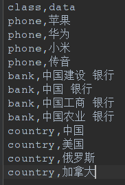

## 环境搭建

##### 方法一:

在当前环境安装本项目使用的环境

`pip install -r ./requirements.txt `

##### 方法二:

创建一个虚拟环境, 用于安装本项目使用的环境

1. `pip install pipenv`
2. `进入项目根目录`
3. `pipenv install`
4. 在项目根目录`pipenv shell`进入虚拟环境即可运行代码

## 快速开始测试

下载**wiki.zh.vec**至项目文件夹下 **./data/** [下载地址](https://fasttext.cc/docs/en/pretrained-vectors.html)

找到或者直接点击Chinese: bin+text, [text](https://dl.fbaipublicfiles.com/fasttext/vectors-wiki/wiki.zh.vec)下载

```
python train.py  # 运行train.py文件进行训练demo数据
```

## 训练自定义数据集

#### 1. 准备你的数据集**csv格式 由 , 分隔**如下:

一列为class用于存储每个类别的标签, 一列为data用于存储每条文本数据



| class   | data          |
| ------- | ------------- |
| phone   | 苹果          |
| phone   | 华为          |
| phone   | 小米          |
| phone   | 传音          |
| bank    | 中国建设 银行 |
| bank    | 中国 银行     |
| bank    | 中国工商银行  |
| bank    | 中国农业银行  |
| country | 中国          |
| country | 美国          |
| country | 俄罗斯        |
| country | 加拿大        |

#### 2. 修改config.py文件

1. train_data_path 为自定义数据的文件路径,也可覆盖demo数据.**默认为: "./data/train_data.csv"**
2. embedded_matrix_size 为嵌入矩阵大小, 根据词频保留的词数,用于构建嵌入矩阵.**默认为: 10240**
3. validation_ratio 为划分测试数据集占总数据集比例. **默认为: 0.2**
4. epochs 为整个数据集迭代次数. **默认为: 512**
5. batch_size 为优化模型每个批次的数据条数. **默认为: 128**
6. learning_rate 为优化模型的学习速率. **默认为: 0.01**
7. learning_rate_decay 为学习速率每个epochs进行衰减的比率. **默认为: 0.95**

#### 3. 运行 train.py 文件对数据进行训练 

1. 运行过程中会在`./save_model/save/`下生成`model.h5`模型文件,运行结束会生成`final_model.h5`
2. 运行过程中会在`./save_model/logs/`下生成并不断更新一个日志文件,在项目根目录执行 `tensorboard --logdir=save_model/logs`即可监控模型训练过程
3. 运行成功后会在`./save_model/deploy/`下生成`可用于服务器部署的 pb 格式文件`:

```
.
└── 0
    ├── saved_model.pb
    └── variables
        ├── variables.data-00000-of-00001
        └── variables.index
```
#### 4. 部署成功后使用 client.py 进行模型的使用 

记得修改`class_dict = {0: "phone", 1: "bank", 2: "country"}`模型输出对应的值,即可得到对应的类别名称